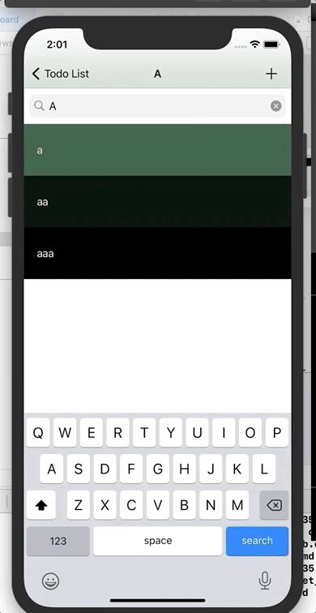

This project is a practice to make persistent data storage using REALM.

The swipe-to-delete functionality is realized using the SwipeCellKit framework.

Dynamic color effect realized using ChameleonFramework.

